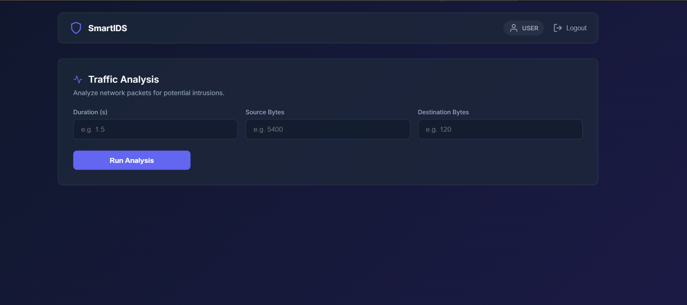
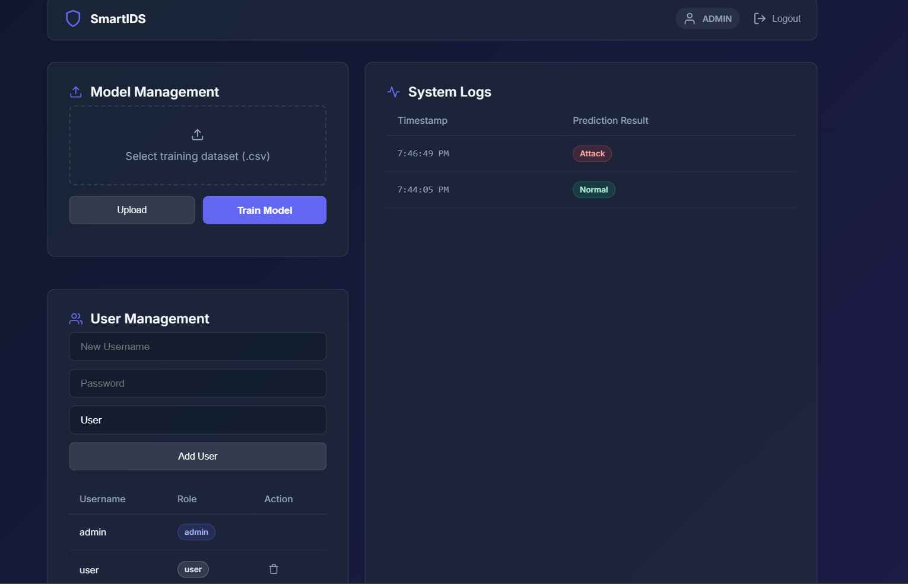

# Intrusion-Detection-System-I.D.S.

##  Project Overview
This project is a web-based Intrusion Detection System designed to identify whether network traffic is Normal or represents a potential Attack.  
It uses a simple intelligent logic (can be extended to machine learning) to analyze key network parameters and provide instant results.

---

##  Objective
The main goal of this project is to:
- Detect suspicious network behavior
- Classify traffic into Normal or Attack
- Provide a simple and interactive interface for users
- Demonstrate the working of an IDS system

---

## Features
- Login system (User & Admin)
- Input network parameters:
  - Duration
  - Source Bytes
  - Destination Bytes
-  Instant prediction (Normal / Attack)
-  Alert message for attacks
-  Admin panel (UI-based controls)

---

## Technologies Used
- **Frontend:** ReactJS (HTML, CSS, JavaScript)
- **Backend:** Flask (Python)
- **Logic:** Rule-based / ML-ready structure
- **Tools:** VS Code, GitHub

---

## Screenshots

### Login Page


###  User Dashboard


### Normal Traffic Output
.png)

###  Attack Detection
.png)

###  Admin Panel


---

## How to Run the Project

###  Backend
```bash
cd backend
python app.py

###  Frontend
cd frontend
npm install
npm run dev
